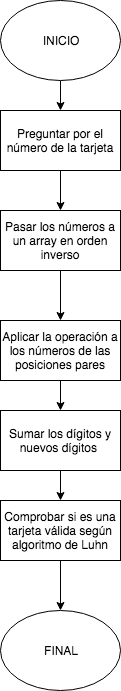

# TARJETA DE CRÉDITO VÁLIDA

### Descripción:

Crea una web que pida, por medio de un prompt(), el número de una tarjeta de crédito y confirme su validez según el algoritmo de Luhn. Lee este blog que explica cómo funciona el algoritmo de Luhn.

## Pseudocódigo

### Descripción

En esta parte se describe la funcionalidad del proyecto por medio de los siguientes pasos:

1. Preguntar por el número de la tarjeta

2. Pasar los números a un array en orden inverso

3. Aplicar la operación a los números de las posiciones pares

4. Sumar los dígitos y nuevos dígitos

5. Comprobar si es una tajeta valida

### Validaciones

- El usuario no puede ingresar un campo vacio

## Diagrama de Flujo

### Descripción

